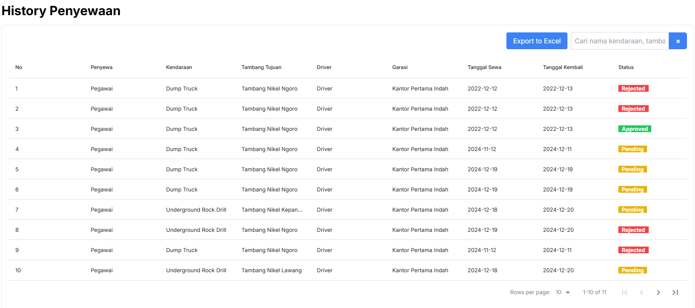

# User Manual (Manager)
## Terima Sewa
- Untuk melakukan penerimaan sewa anda bisa klik button `pena`, seperti gambar di bawah ini :
.png)
- Kemudian mengisi statusnya, seperti gambar dibawah ini :
.png)

## Laporan Tambang
### Melihat Tambang
- untuk melihat tambang anda bisa klik sidebar menu `Tambang` 

## Laporan Kendaraan
### Melihat Informasi Kendaraan
- untuk melihat tambang anda bisa klik sidebar menu `Kendaraan` 

## Laporan History Penyewaan
### Melihat laporan penyewaan
- untuk melihat tambang anda bisa klik sidebar menu `History Penyewaan` 

### Melakukan Ekspor Excel
- untuk melakukan ekspor excel anda bisa klik button `Export Excel` 
.png)
- Kemudian file excel akan otomatis terdownload dan berada di folder `downloads atau di tempat yang sudah anda taruh` : 
.png)