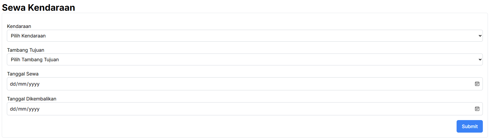
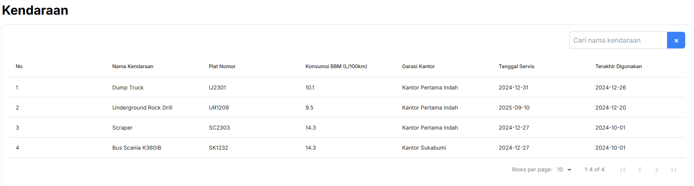
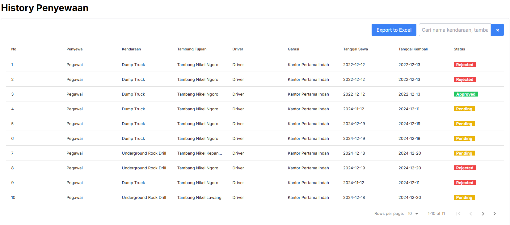

# User Manual (Pegawai)
## Sewa Kendaraan
- Untuk melakukan penyewaan kendaraan anda bisa klik menu sidebar `Sewa Kendaraan` Kemudian isi form yang sudah disediakan :

## Laporan Kendaraan
### Melihat Informasi Kendaraan
- untuk melihat tambang anda bisa klik sidebar menu `Kendaraan` 

## Laporan History Penyewaan
### Melihat laporan penyewaan
- untuk melihat tambang anda bisa klik sidebar menu `History Penyewaan` 
